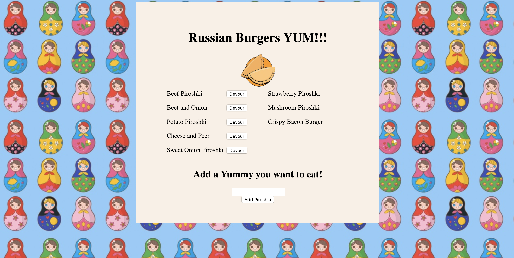

# Burger
Burger is a restaurant app that lets users input the names of burgers they'd like to eat. Whenever a user submits a burger's (or russian version - Piroshki) name, app will display the burger on the left side of the page -- waiting to be devoured. Each burger in the waiting area also has a `Devour` button. When the user clicks it, the burger will move to the right side of the page.  App will store every burger in a database, whether devoured or not.

# Technologies Used
- HTML
- Javascript
- ORM
- Express
- Node
- JSON
- CSS
- Handlebars.js 
- MySQL
# Demo
Please follow the link to [Heroku](https://russian-burger.herokuapp.com/) deployment to play with the project.

